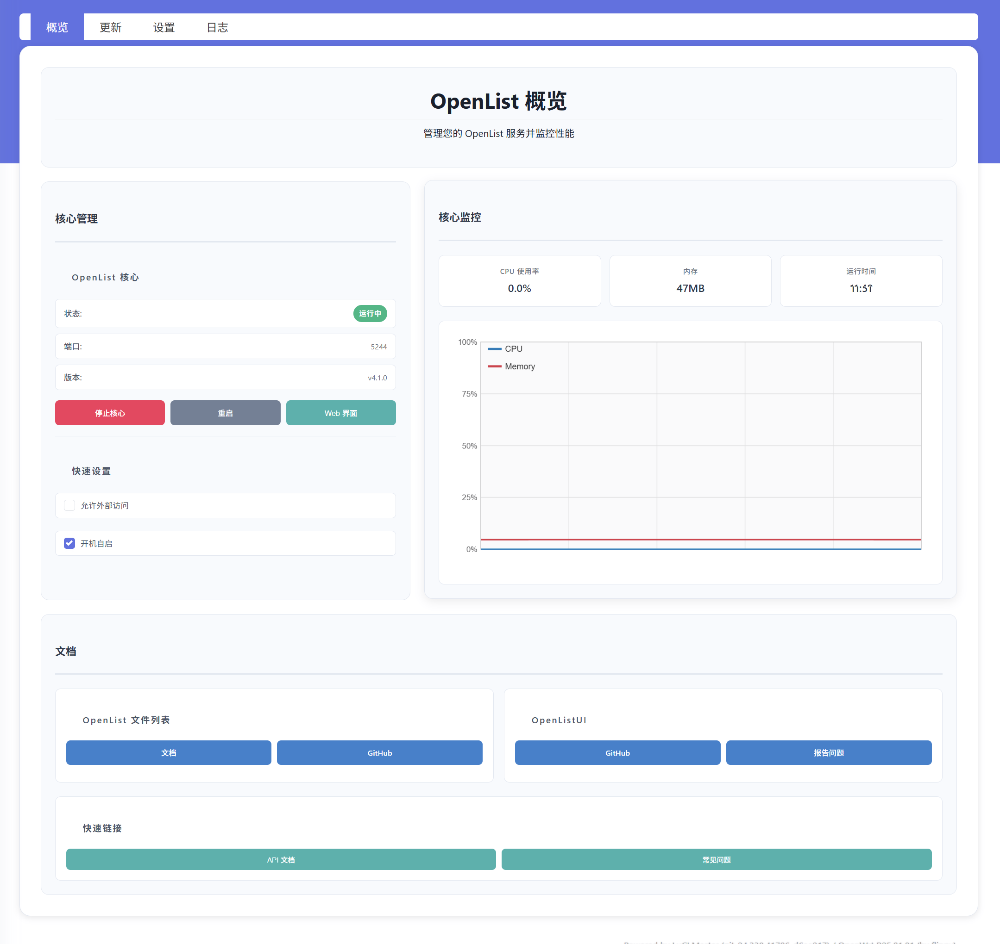
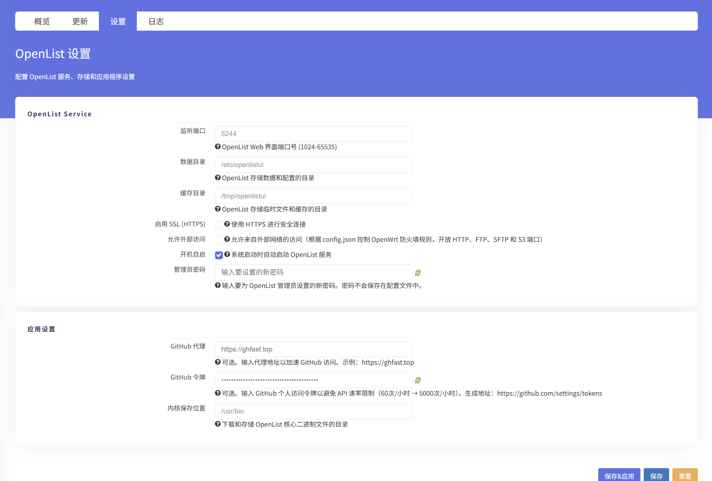

<div align="center">
  
</div>

## 功能特性

- 🎯 **现代化界面设计** - 采用响应式布局，支持多种设备访问
- 📊 **系统概览** - 实时显示系统状态、服务运行情况和资源使用
- 🔄 **更新管理** - 便捷的组件更新和版本管理
- 📝 **日志查看** - 实时日志监控，支持过滤和自动刷新
- ⚙️ **配置管理** - 简化的配置界面，支持各种参数调整
- 🌐 **多语言支持** - 支持中文界面

## 界面预览

### 系统概览


系统概览页面提供了完整的系统状态监控，包括：
- 服务运行状态
- 系统资源使用情况
- 快速操作按钮
- 系统信息展示

### 更新管理


更新管理页面支持：
- 组件版本查看
- 一键更新功能
- 更新进度显示
- 更新日志查看

### 配置设置


配置设置页面包含：
- 服务配置选项
- 网络设置
- 安全配置
- 高级选项

## 快速开始

### 编译安装

```bash
# 编译默认架构 (x86_64)
./build.sh

# 编译指定架构
./build.sh aarch64
./build.sh mips
./build.sh mipsel
./build.sh arm
./build.sh armv7

# 编译所有支持的架构
./build.sh all

# 快速编译（跳过feeds更新）
./build.sh --fast
./build.sh -f x86_64

# 开发模式（包含时间戳）
./build.sh --dev x86_64

# 显示版本信息
./build.sh version

# 清理构建文件
./build.sh clean

# 显示帮助信息
./build.sh help
```

### 构建输出

每次构建会生成：
- **IPK包**: `output/luci-app-openlistui_架构_时间戳.ipk`
- **构建信息**: `output/luci-app-openlistui_架构_时间戳.info`
- **构建日志**: `build-logs/build-架构-时间戳.log`
- **版本信息**: 包内 `/usr/lib/lua/luci/version-openlistui`

## 配置文件

可以通过 `build.conf` 自定义构建参数：
- 默认架构
- SDK URLs
- 构建选项
- 依赖包列表

## 支持的架构

- **x86_64** - x86 64位 (默认)
- **aarch64** - ARM 64位
- **mips** - MIPS 大端序 (ath79)
- **mipsel** - MIPS 小端序 (ramips)
- **arm** - ARM 32位 (bcm2708)
- **armv7** - ARMv7 (bcm2709)

## 构建选项

- `-f, --fast` - 跳过feeds更新 (适用于重复构建)
- `--dev` - 开发模式，为包文件名添加时间戳

## 安装说明

1. **编译IPK包**: 使用构建脚本编译对应架构的IPK包
2. **安装界面包**: 安装编译生成的 `luci-app-openlistui` IPK包
3. **重启服务**: 重启 uhttpd 服务以加载新界面
4. **访问界面**: 通过 OpenWrt 管理界面访问 OpenList 管理页面

## 开发说明

### 目录结构

```
luci-app-openlist/
├── luasrc/                 # Lua 源码
│   ├── controller/         # 控制器
│   ├── model/             # 数据模型
│   └── view/              # 视图模板
├── htdocs/                # 静态资源
├── po/                    # 多语言文件
├── root/                  # 系统文件
├── screenshots/           # 界面截图
└── CONTROL/               # 包控制文件
```

### 开发命令

```bash
# 检查版本信息
make version

# 生成版本文件（调试用）
make gen-version

# 查看构建变量
grep "PKG_" Makefile
```

## 注意事项

- 此包为独立的 LuCI 网页界面，无需依赖额外的核心包
- 使用 `openlistui` 命名空间避免与原始 `luci-app-openlist` 冲突
- 确保 OpenWrt 系统版本兼容性
- 支持多种主流路由器架构

## 许可证

MIT License

## 贡献

欢迎提交 Issue 和 Pull Request 来改进这个项目。

---

**OpenList WebUI** - 让文件管理更简单
